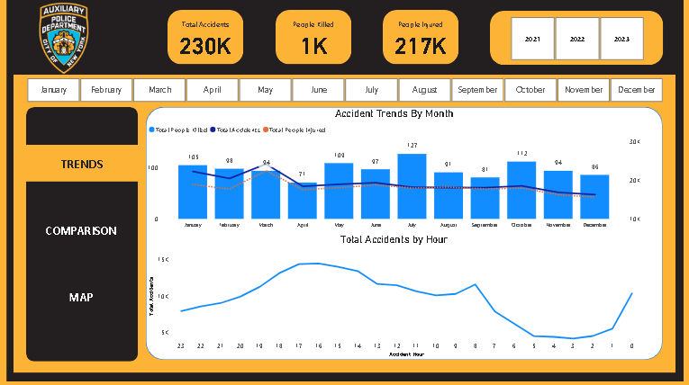
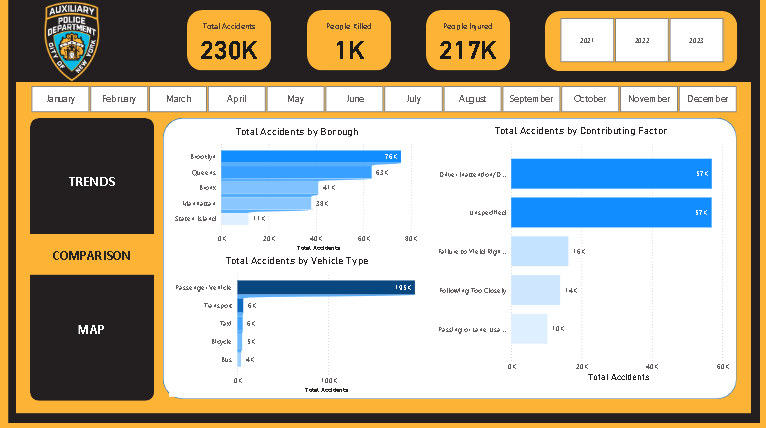
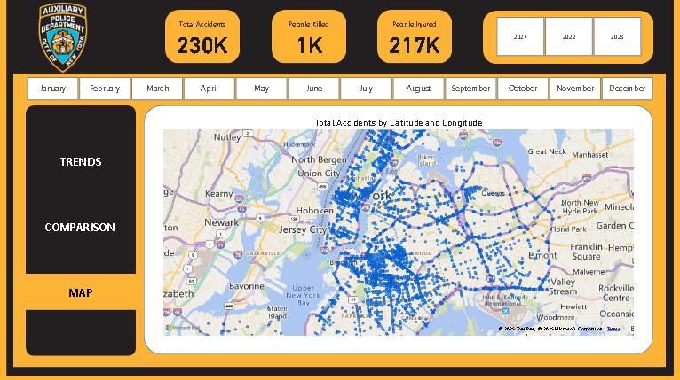

# 📊 NYC Motor Vehicle Collision Analysis (2021-2023)

## Project Overview
This repository contains the analysis and Key Performance Indicator (KPI) report created for the New York City (NYC) office, focusing on motor vehicle collision data reported by the **New York City Police Department (NYPD)**.

The primary objectives of this analysis were to identify:
1.  **Temporal trends** for accidents and casualties (time, day, and month).
2.  **Location-based hotspots** that are more prone to accidents.
3.  **Key factors and vehicle types** contributing to these collisions.

---

## 📅 Data & Time Period
* **Source:** NYC Open Data Portal (Motor Vehicle Collisions)
* **Time Period:** January 2021 to April 2023
* **Total Records:** 238,421 collisions

### Key Data Fields
The analysis utilized fields including: `Collision ID`, `Date`, `Time`, `Borough`, `Contributing Factor`, `Persons Injured`, and `Persons Killed`.

---

## 📈 Executive Summary of Key Findings

From January 2021 to April 2023, the dataset recorded **230,000+ collisions**, resulting in **116,227+ injuries** and **635 deaths**.

### A. Temporal Findings
* **Most Dangerous Day:** **Friday** is the most dangerous day, responsible for **18% of all deaths**.
* **Most Dangerous Month:** **July** is the top month for crashes and casualties, with deaths increasing by **38%** from the average.
* **Peak Accident Time:** Most accidents and injuries happen between **4 PM and 5 PM**, likely due to high traffic.
* **Peak Fatality Time:** Most casualty-heavy accidents happen between **3 AM and 5 AM**, peaking around **4 AM**. This is likely due to poor lighting and reckless/drunk driving.

### B. Location Findings
* **Most Dangerous Borough:** **Brooklyn** is the most dangerous borough, accounting for approximately **29% of all casualties**.
* **Top 3 Boroughs for Casualties:** Brooklyn (**29%**), Queens (**25%**), and the Bronx (**20%**).
* **Most Dangerous Street:** **Belt Parkway**, which is responsible for **3%** of all casualties.

### C. Contributing Factors
* **Top Contributing Factor (by Death):** **Unsafe Speed** is responsible for the highest number of deaths (145).
* **Other Top Factors (by Death):** **Driver Inattention/Distraction** (74 deaths) and **Failure to Yield Right-of-Way** (46 deaths).
* **Vehicle Involvement:** **Passenger Vehicles** are involved in about **85%** of all accidents.
* **Casualty Breakdown:** Motorists contribute to about **42%** of all deaths, while over **45%** of all deaths involve pedestrians.

---

## 🖼️ Power BI Visualizations

The following screenshots capture the key dashboards used for this analysis.

### 1. Trends Dashboard (Temporal Analysis)
This dashboard visualizes accident, injury, and fatality trends over time (by month and by hour).

### 2. Comparison Dashboard (Boroughs, Factors, & Vehicle Types)
This view compares collision counts across boroughs, primary contributing factors, and involved vehicle types.

### 3. Map Dashboard (Location-Based Analysis)
This map visualizes the precise latitude and longitude of all recorded collisions, highlighting accident clusters and high-risk roads.

---

## 🛠️ Data Cleaning Summary

Initial data cleaning and handling steps performed:

| Column | Issue | Magnitude | Resolution |
| :--- | :--- | :--- | :--- |
| **Cross Street** | Missing Values | 53.32% | Dropped the column |
| **Borough** | Missing Values | 3.02% | Recategorized to "Unknown" |
| **Contributing Factor** | Missing Values | 0.54% | Recategorized to "Unspecified" |
| **Persons Injured** | Missing Values | 0.00% (1 row) | Replaced with `0` |
| **Vehicle Type** | Weird/Unknown Categories | 1.88% | Combined and recategorized to "Others" |

---

## 💡 Recommendations
The following recommendations are proposed to the city office based on the analysis:
* Increase the number of traffic police and improve traffic flow during crowded hours.
* Conduct awareness campaigns around rush hours.
* Increase the fine for reckless high-speed driving.
* Install railings on sidewalks to decrease pedestrian involvement in accidents.
* Add traffic rules to the curriculum of school students.
